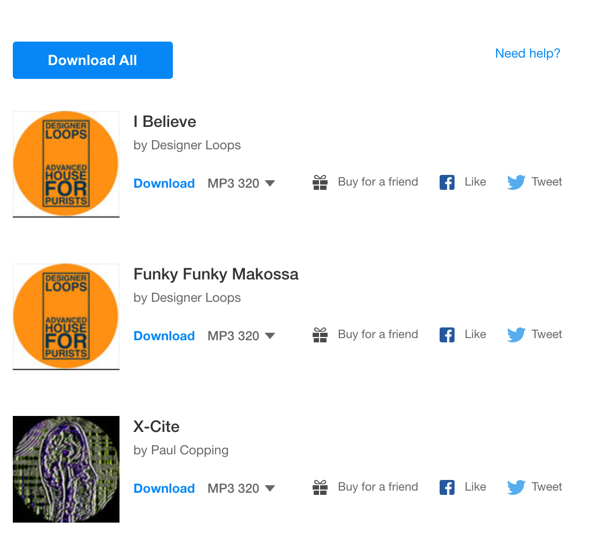

# Bandcamp download all button

A simple tool that let's you download all items in a purchase.

## Instructions

- Create a new bookmark in your browser
- Set the name to `Bandcamp Downloader`
- Set the URL to

```
javascript:(()=>{if(window.location.href.includes("https://bandcamp.com/download?cart_id=")){const n=()=>jQuery("span.download-title a").map((n,o)=>setTimeout(()=>window.location=jQuery(o).attr("href"),5e3*n));jQuery("<input />",{type:"button",value:"Download All",click:n,style:"\n        background: #0687f5;\n        color: white;\n        font-weight: bold;\n        padding: 10px;\n        width: 150px;\n        border: 0;\n        border-radius: 3px;\n        margin-bottom: 30px;\n        cursor: pointer;\n      "}).insertBefore("ul.downloads li:first")}})();
```


